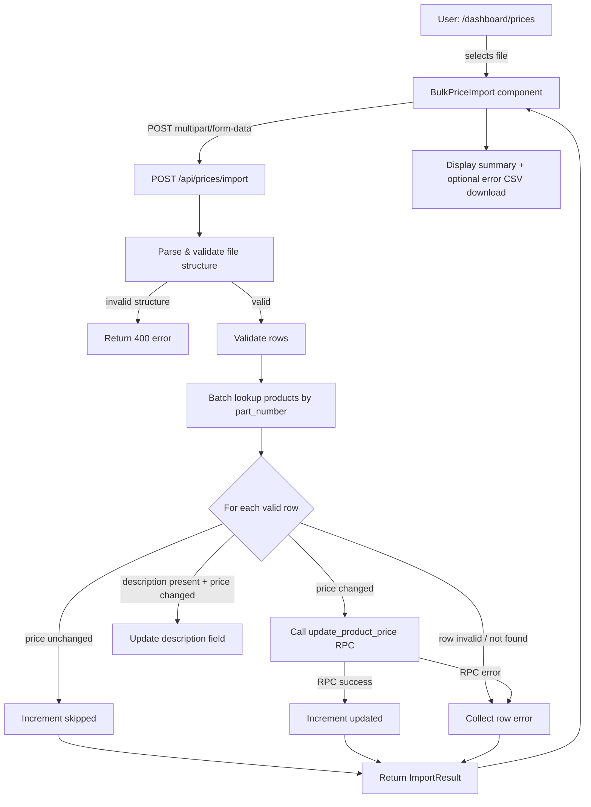

# Design Document: Bulk Price Import

## Overview

The Bulk Price Import feature adds a third tab to the `/dashboard/prices` page, allowing users to upload a vendor price list Excel file and apply `cost_price` updates in bulk. The design reuses the existing `update_product_price` RPC for every price change, ensuring atomicity and audit-trail consistency with manual price edits. Rows where the price is unchanged are silently skipped; row-level errors are collected and returned without aborting the rest of the import.

The feature follows the same structural patterns already established by the product Excel import (`/api/products/import`, `ExcelImport` component) and the manual price update flow (`/api/prices/[id]`, `PriceEditDialog`).

---

## Architecture



The new API route (`/api/prices/import`) is a self-contained Next.js Route Handler. It does not introduce any new database tables or migrations — it relies entirely on the existing `products` table and the `update_product_price` RPC.

---

## Components and Interfaces

### New files

| Path | Purpose |
|---|---|
| `app/api/prices/import/route.ts` | POST handler — parses Excel, validates, calls RPC, returns `ImportResult` |
| `components/prices/BulkPriceImport.tsx` | Client component — file picker, loading state, result display |

### Modified files

| Path | Change |
|---|---|
| `app/dashboard/prices/page.tsx` | Add "Bulk Price Import" `TabsTrigger` + `TabsContent` |
| `lib/types/price.ts` | Add `ImportResult` and `PriceImportRow` types |

### `ImportResult` type (added to `lib/types/price.ts`)

```typescript
export interface PriceImportRow {
  part_number: string;
  new_price: number;
  description?: string;
}

export interface ImportResult {
  updated: number;
  skipped: number;
  failed: number;
  errors: string[];   // per-row error messages including Excel row number
}
```

### API contract: `POST /api/prices/import`

- **Request**: `multipart/form-data` with a single `file` field (`.xlsx` / `.xls`)
- **Response 200**: `ApiResponse<ImportResult>` — always returned when file-level validation passes, even if all rows fail
- **Response 400**: `ApiResponse<null>` — file-level validation failure (wrong extension, empty file, missing required columns, no data rows)
- **Response 401**: `ApiResponse<null>` — unauthenticated request
- **Response 500**: `ApiResponse<null>` — unexpected server error

### `BulkPriceImport` component props

```typescript
interface BulkPriceImportProps {
  // no props required — self-contained
}
```

---

## Data Models

No new database tables or migrations are required.

### Existing tables used

**`products`**
- `id` (uuid) — used as `p_product_id` in RPC calls
- `part_number` (text) — matched against import rows
- `cost_price` (numeric) — compared to `new_price` to decide skip vs update
- `description` (text) — optionally updated when import row includes a non-empty description

**`product_price_history`** (written by RPC, not directly by the route)
- `product_id`, `field_name`, `old_value`, `new_value`, `changed_by`, `changed_at`

### `update_product_price` RPC signature (existing)

```sql
update_product_price(
  p_product_id  uuid,
  p_field_name  text,      -- always 'cost_price' for this feature
  p_new_value   numeric,
  p_changed_by  text       -- Clerk userId from authenticated session
)
```

The RPC is a no-op when `p_new_value` equals the current value, so the application-level skip check (Requirement 4.3) is a performance optimisation that avoids unnecessary RPC round-trips.

---

## Correctness Properties

*A property is a characteristic or behavior that should hold true across all valid executions of a system — essentially, a formal statement about what the system should do. Properties serve as the bridge between human-readable specifications and machine-verifiable correctness guarantees.*

### Property 1: Invalid file extension is always rejected

*For any* filename whose extension is not `.xlsx` or `.xls`, the client-side validation function should return an error and must not proceed to upload the file.

**Validates: Requirements 1.3**

---

### Property 2: Missing required column produces a named error

*For any* Excel file that is missing one or both of the required columns (`part_number`, `new_price`), the API should return a 400 error whose message identifies every missing column by name, and no rows should be processed.

**Validates: Requirements 2.2**

---

### Property 3: Row with invalid part_number produces a row-level error and processing continues

*For any* import file where one or more rows have an empty or missing `part_number`, each such row should produce a row-level error message, and all other rows should still be processed normally.

**Validates: Requirements 3.1**

---

### Property 4: Row with invalid new_price produces a row-level error and processing continues

*For any* import file where one or more rows have a `new_price` that is non-numeric, negative, or missing, each such row should produce a row-level error message, and all other rows should still be processed normally.

**Validates: Requirements 3.2**

---

### Property 5: Unmatched part_number produces a named row-level error and processing continues

*For any* import row whose `part_number` does not exist in the products table, a row-level error should be recorded that includes the unmatched part number, and all other rows should still be processed normally.

**Validates: Requirements 3.4**

---

### Property 6: Every row-level error message contains the Excel row number

*For any* import file that produces one or more row-level errors, every error message in the `errors` array should contain the Excel row number (1-indexed, counting the header as row 1) of the offending row.

**Validates: Requirements 3.5**

---

### Property 7: Changed price triggers RPC call with correct arguments

*For any* valid import row where `new_price` differs from the product's current `cost_price`, the `update_product_price` RPC should be called exactly once with `p_field_name = 'cost_price'`, `p_new_value` equal to `new_price`, and `p_changed_by` equal to the authenticated user's ID.

**Validates: Requirements 4.1, 6.2**

---

### Property 8: Unchanged price is skipped without an RPC call

*For any* valid import row where `new_price` equals the product's current `cost_price`, the `update_product_price` RPC should not be called for that row, and the `skipped` count in the result should be incremented.

**Validates: Requirements 4.3**

---

### Property 9: RPC failure produces a row-level error and processing continues

*For any* import row where the `update_product_price` RPC returns an error, a row-level error should be recorded for that row, the product's `cost_price` should remain unchanged, and all subsequent rows should still be processed.

**Validates: Requirements 4.5**

---

### Property 10: Import result counts are consistent

*For any* import file that passes file-level validation, `updated + skipped + failed` should equal the total number of data rows in the file.

**Validates: Requirements 5.1**

---

## Error Handling

### File-level errors (abort entire import, return 400)

| Condition | Error message |
|---|---|
| Wrong file extension | `"Invalid file format. Only .xlsx and .xls files are supported"` |
| No worksheets in workbook | `"Excel file is empty"` |
| Missing `part_number` column | `"Missing required column: part_number"` |
| Missing `new_price` column | `"Missing required column: new_price"` |
| Both columns missing | `"Missing required columns: part_number, new_price"` |
| Zero data rows | `"Excel file contains no data rows"` |

### Row-level errors (collected, processing continues)

| Condition | Error message format |
|---|---|
| Empty/missing `part_number` | `"Row {n}: part_number is required"` |
| Non-numeric `new_price` | `"Row {n}: new_price must be a valid number"` |
| Negative `new_price` | `"Row {n}: new_price must be 0 or greater"` |
| Missing `new_price` | `"Row {n}: new_price is required"` |
| Part number not found | `"Row {n}: part number '{part_number}' not found"` |
| RPC failure | `"Row {n}: failed to update price for '{part_number}'"` |

Row numbers are Excel row numbers (header = row 1, first data row = row 2).

### Client-side error handling

- File extension validation happens before upload (no network request made)
- HTTP 4xx/5xx responses surface the `error` field from the API response body
- Network errors are caught and displayed as generic error messages
- The loading state is always cleared in a `finally` block

---

## Testing Strategy

### Unit tests

Focus on specific examples, edge cases, and the pure validation logic:

- `validatePriceImportFile` — file-level column detection with various header combinations
- `validatePriceImportRow` — row validation with boundary values (zero price, empty string, negative)
- `BulkPriceImport` component rendering — result display states (all-skipped, partial errors, full success)
- `BulkPriceImport` component — file extension rejection before upload

### Property-based tests

Property-based testing is appropriate here because the import logic contains pure validation and counting functions whose correctness must hold across a wide range of inputs (arbitrary filenames, arbitrary price values, arbitrary row combinations).

**Library**: [fast-check](https://github.com/dubzzz/fast-check) (already consistent with the TypeScript/Next.js stack)

**Minimum iterations**: 100 per property test

**Tag format**: `// Feature: bulk-price-import, Property {N}: {property_text}`

Each correctness property maps to one property-based test:

| Property | Test description |
|---|---|
| P1 | Generate random filenames with non-xlsx/xls extensions → validation rejects |
| P2 | Generate workbooks missing subsets of required columns → API returns 400 naming missing columns |
| P3 | Generate files with mixed valid/invalid part_number rows → invalid rows error, valid rows process |
| P4 | Generate files with mixed valid/invalid new_price values → invalid rows error, valid rows process |
| P5 | Generate files with random unknown part_numbers → row errors name the part_number, others process |
| P6 | Generate files with any error-producing rows → all error messages contain the Excel row number |
| P7 | Generate random products + changed prices → RPC called with correct field_name, value, user ID |
| P8 | Generate random products + unchanged prices → RPC not called, skipped count incremented |
| P9 | Generate files where RPC fails for some rows → those rows error, others still process |
| P10 | Generate any valid import file → updated + skipped + failed == total data rows |

### Integration tests

- `POST /api/prices/import` with a real Supabase test database: verify that after a successful import, `products.cost_price` is updated and a `product_price_history` row exists (validates Requirement 4.2)
- `POST /api/prices/import` without auth header → 401 (validates Requirement 6.1)
