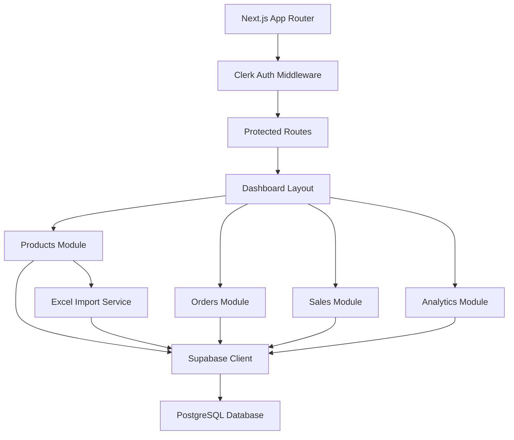
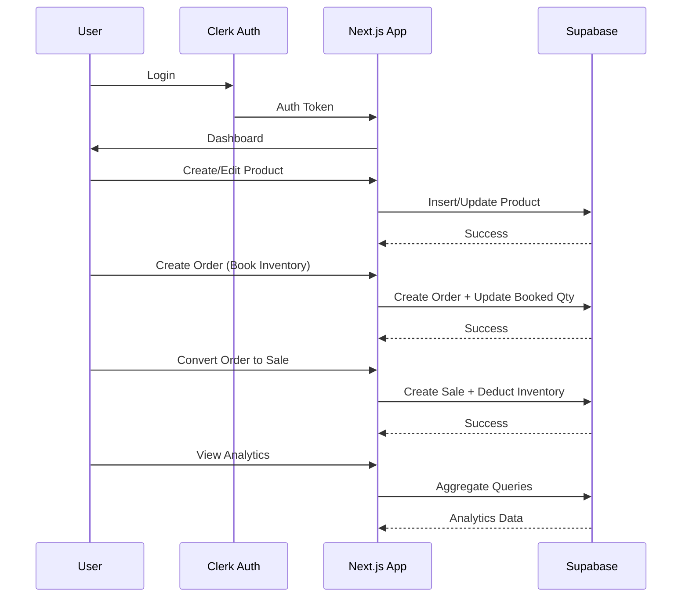

# Design Document: Inventory Management App

## Overview

A comprehensive inventory management system for mobile parts built with Next.js 14 (App Router), TypeScript, Supabase, and Clerk. The system enables authenticated users to manage product inventory, create client orders with booking functionality, convert orders to sales with automatic inventory deduction, and view analytics on sales performance, profit, and inventory value. The application features a modern dashboard with advanced table operations (search, filter, sort, pagination), Excel import for bulk uploads, and real-time inventory tracking distinguishing between total, booked, and available quantities.

## Architecture



## Main Workflow




## Database Schema

### Table: products

```typescript
interface Product {
  id: string;                    // UUID, primary key
  part_number: string;           // NOT NULL, indexed
  model: string;                 // NOT NULL
  model_code: string;            // NOT NULL, indexed
  description: string;           // NOT NULL
  color: string | null;          // NULLABLE
  qty: number;                   // DEFAULT 0, total physical inventory
  booked_qty: number;            // DEFAULT 0, quantity reserved in orders
  cost_price: number;            // DEFAULT 0, in EUR
  sell_price: number;            // DEFAULT 0, in EUR
  created_at: string;            // TIMESTAMP, auto-generated
  updated_at: string;            // TIMESTAMP, auto-updated
  user_id: string;               // Foreign key to Clerk user
}

// Computed field (not stored):
// available_qty = qty - booked_qty
```

### Table: clients

```typescript
interface Client {
  id: string;                    // UUID, primary key
  name: string;                  // NOT NULL
  email: string | null;          // NULLABLE
  phone: string | null;          // NULLABLE
  address: string | null;        // NULLABLE
  created_at: string;            // TIMESTAMP
  updated_at: string;            // TIMESTAMP
  user_id: string;               // Foreign key to Clerk user
}
```

### Table: orders

```typescript
interface Order {
  id: string;                    // UUID, primary key
  order_number: string;          // NOT NULL, unique, auto-generated
  client_id: string;             // Foreign key to clients
  status: 'pending' | 'completed' | 'cancelled'; // DEFAULT 'pending'
  total_amount: number;          // Calculated sum of order items
  notes: string | null;          // NULLABLE
  created_at: string;            // TIMESTAMP
  updated_at: string;            // TIMESTAMP
  user_id: string;               // Foreign key to Clerk user
}
```

### Table: order_items

```typescript
interface OrderItem {
  id: string;                    // UUID, primary key
  order_id: string;              // Foreign key to orders
  product_id: string;            // Foreign key to products
  quantity: number;              // NOT NULL, must be > 0
  unit_price: number;            // Price at time of order (EUR)
  subtotal: number;              // quantity * unit_price
  created_at: string;            // TIMESTAMP
}
```

### Table: sales

```typescript
interface Sale {
  id: string;                    // UUID, primary key
  sale_number: string;           // NOT NULL, unique, auto-generated
  order_id: string | null;       // Foreign key to orders (nullable for direct sales)
  client_id: string;             // Foreign key to clients
  total_amount: number;          // Total sale amount
  total_cost: number;            // Total cost (for profit calculation)
  profit: number;                // total_amount - total_cost
  notes: string | null;          // NULLABLE
  sale_date: string;             // TIMESTAMP, defaults to now
  created_at: string;            // TIMESTAMP
  user_id: string;               // Foreign key to Clerk user
}
```

### Table: sale_items

```typescript
interface SaleItem {
  id: string;                    // UUID, primary key
  sale_id: string;               // Foreign key to sales
  product_id: string;            // Foreign key to products
  quantity: number;              // NOT NULL, must be > 0
  unit_price: number;            // Selling price (EUR)
  unit_cost: number;             // Cost price at time of sale (EUR)
  subtotal: number;              // quantity * unit_price
  cost_total: number;            // quantity * unit_cost
  profit: number;                // subtotal - cost_total
  created_at: string;            // TIMESTAMP
}
```


## Core Type Definitions

### API Response Types

```typescript
type ApiResponse<T> = {
  data: T | null;
  error: string | null;
  success: boolean;
};

type PaginatedResponse<T> = {
  data: T[];
  total: number;
  page: number;
  pageSize: number;
  totalPages: number;
};

type TableFilters = {
  search?: string;
  sortBy?: string;
  sortOrder?: 'asc' | 'desc';
  page?: number;
  pageSize?: number;
  [key: string]: any;
};
```

### View Models

```typescript
interface ProductWithAvailability extends Product {
  available_qty: number;  // Computed: qty - booked_qty
}

interface OrderWithDetails extends Order {
  client: Client;
  items: OrderItemWithProduct[];
  item_count: number;
}

interface OrderItemWithProduct extends OrderItem {
  product: Product;
}

interface SaleWithDetails extends Sale {
  client: Client;
  items: SaleItemWithProduct[];
  item_count: number;
}

interface SaleItemWithProduct extends SaleItem {
  product: Product;
}

interface InventoryOverview {
  total_qty: number;
  booked_qty: number;
  available_qty: number;
  total_value: number;        // Sum of (qty * cost_price)
  total_products: number;
}

interface AnalyticsSummary {
  total_revenue: number;
  total_profit: number;
  total_sales: number;
  profit_margin: number;      // (total_profit / total_revenue) * 100
  top_selling_products: TopSellingProduct[];
  sales_by_period: SalesByPeriod[];
}

interface TopSellingProduct {
  product_id: string;
  part_number: string;
  model: string;
  total_quantity_sold: number;
  total_revenue: number;
  total_profit: number;
}

interface SalesByPeriod {
  period: string;             // Date string (YYYY-MM-DD or YYYY-MM)
  total_sales: number;
  total_revenue: number;
  total_profit: number;
}
```


## Component Architecture

### App Structure

```
app/
├── (auth)/
│   └── sign-in/
│       └── [[...sign-in]]/
│           └── page.tsx          # Clerk sign-in page
├── (dashboard)/
│   ├── layout.tsx                # Dashboard layout with sidebar
│   ├── page.tsx                  # Dashboard home (overview)
│   ├── products/
│   │   ├── page.tsx              # Products list
│   │   ├── new/
│   │   │   └── page.tsx          # Add product form
│   │   └── [id]/
│   │       └── edit/
│   │           └── page.tsx      # Edit product form
│   ├── orders/
│   │   ├── page.tsx              # Orders list
│   │   ├── new/
│   │   │   └── page.tsx          # Create order form
│   │   └── [id]/
│   │       ├── page.tsx          # Order details
│   │       └── convert/
│   │           └── page.tsx      # Convert order to sale
│   ├── sales/
│   │   ├── page.tsx              # Sales list
│   │   └── [id]/
│   │       └── page.tsx          # Sale details
│   ├── clients/
│   │   ├── page.tsx              # Clients list
│   │   └── new/
│   │       └── page.tsx          # Add client form
│   └── analytics/
│       └── page.tsx              # Analytics dashboard
├── api/
│   ├── products/
│   │   ├── route.ts              # GET (list), POST (create)
│   │   ├── [id]/
│   │   │   └── route.ts          # GET, PATCH, DELETE
│   │   └── import/
│   │       └── route.ts          # POST (Excel import)
│   ├── orders/
│   │   ├── route.ts              # GET (list), POST (create)
│   │   ├── [id]/
│   │   │   └── route.ts          # GET, PATCH, DELETE
│   │   └── [id]/
│   │       └── convert/
│   │           └── route.ts      # POST (convert to sale)
│   ├── sales/
│   │   ├── route.ts              # GET (list), POST (create)
│   │   └── [id]/
│   │       └── route.ts          # GET
│   ├── clients/
│   │   ├── route.ts              # GET (list), POST (create)
│   │   └── [id]/
│   │       └── route.ts          # GET, PATCH, DELETE
│   └── analytics/
│       ├── overview/
│       │   └── route.ts          # GET (summary stats)
│       ├── top-products/
│       │   └── route.ts          # GET (top selling)
│       └── sales-trends/
│           └── route.ts          # GET (sales by period)
└── middleware.ts                 # Clerk auth middleware
```

### Key React Components

```typescript
// components/products/ProductTable.tsx
interface ProductTableProps {
  initialData?: Product[];
  userId: string;
}

// components/products/ProductForm.tsx
interface ProductFormProps {
  product?: Product;
  onSubmit: (data: ProductFormData) => Promise<void>;
  onCancel: () => void;
}

// components/products/ExcelImport.tsx
interface ExcelImportProps {
  onImportComplete: () => void;
}

// components/orders/OrderForm.tsx
interface OrderFormProps {
  order?: Order;
  onSubmit: (data: OrderFormData) => Promise<void>;
}

// components/orders/OrderItemsSelector.tsx
interface OrderItemsSelectorProps {
  items: OrderItemInput[];
  onChange: (items: OrderItemInput[]) => void;
  availableProducts: ProductWithAvailability[];
}

// components/shared/DataTable.tsx
interface DataTableProps<T> {
  data: T[];
  columns: ColumnDef<T>[];
  searchable?: boolean;
  filterable?: boolean;
  sortable?: boolean;
  pagination?: boolean;
  onRowClick?: (row: T) => void;
}

// components/analytics/AnalyticsCard.tsx
interface AnalyticsCardProps {
  title: string;
  value: string | number;
  subtitle?: string;
  trend?: {
    value: number;
    direction: 'up' | 'down';
  };
  icon?: React.ReactNode;
}

// components/analytics/SalesChart.tsx
interface SalesChartProps {
  data: SalesByPeriod[];
  period: 'day' | 'week' | 'month';
}
```


## Key Functions with Formal Specifications

### Function 1: createProduct()

```typescript
async function createProduct(
  data: ProductFormData,
  userId: string
): Promise<ApiResponse<Product>>
```

**Preconditions:**
- `data` is validated and well-formed
- `data.part_number` is non-empty string
- `data.model` is non-empty string
- `data.model_code` is non-empty string
- `data.description` is non-empty string
- `data.qty >= 0`
- `data.cost_price >= 0`
- `data.sell_price >= 0`
- `userId` is valid Clerk user ID

**Postconditions:**
- Returns `ApiResponse<Product>` with `success: true` if product created
- New product has `booked_qty = 0`
- New product has `id` (UUID) assigned
- New product has `created_at` and `updated_at` timestamps
- If error: returns `ApiResponse` with `success: false` and error message
- Database transaction is atomic (all-or-nothing)

**Loop Invariants:** N/A

---

### Function 2: createOrder()

```typescript
async function createOrder(
  orderData: OrderFormData,
  items: OrderItemInput[],
  userId: string
): Promise<ApiResponse<Order>>
```

**Preconditions:**
- `orderData.client_id` references existing client
- `items` is non-empty array
- For each item in `items`:
  - `item.product_id` references existing product
  - `item.quantity > 0`
  - `item.quantity <= product.available_qty` (qty - booked_qty)
- `userId` is valid Clerk user ID

**Postconditions:**
- Returns `ApiResponse<Order>` with `success: true` if order created
- New order has unique `order_number` generated
- For each order item:
  - Corresponding product's `booked_qty` increased by `item.quantity`
  - `unit_price` captured from product's current `sell_price`
  - `subtotal` calculated as `quantity * unit_price`
- Order's `total_amount` equals sum of all item subtotals
- Order's `status` is 'pending'
- If any product has insufficient available quantity: transaction rolls back
- Database transaction is atomic (all-or-nothing)

**Loop Invariants:**
- For each processed item: `product.booked_qty` correctly incremented
- Running total matches sum of processed item subtotals

---

### Function 3: convertOrderToSale()

```typescript
async function convertOrderToSale(
  orderId: string,
  userId: string
): Promise<ApiResponse<Sale>>
```

**Preconditions:**
- `orderId` references existing order
- Order's `status` is 'pending'
- Order has at least one order item
- For each order item:
  - Referenced product exists
  - Product has sufficient `qty` to fulfill `item.quantity`
- `userId` is valid Clerk user ID and owns the order

**Postconditions:**
- Returns `ApiResponse<Sale>` with `success: true` if conversion successful
- New sale created with unique `sale_number`
- Sale's `order_id` references the original order
- For each order item converted to sale item:
  - Product's `qty` decreased by `item.quantity`
  - Product's `booked_qty` decreased by `item.quantity`
  - Sale item's `unit_cost` captured from product's current `cost_price`
  - Sale item's `profit` calculated as `(unit_price - unit_cost) * quantity`
- Sale's `total_cost` equals sum of all sale item `cost_total` values
- Sale's `profit` equals sum of all sale item `profit` values
- Order's `status` updated to 'completed'
- If any product has insufficient quantity: transaction rolls back
- Database transaction is atomic (all-or-nothing)

**Loop Invariants:**
- For each processed item:
  - Product's `qty` and `booked_qty` correctly decremented
  - Running totals (cost, profit) match sum of processed items

---

### Function 4: getInventoryOverview()

```typescript
async function getInventoryOverview(
  userId: string
): Promise<ApiResponse<InventoryOverview>>
```

**Preconditions:**
- `userId` is valid Clerk user ID

**Postconditions:**
- Returns `ApiResponse<InventoryOverview>` with aggregated data
- `total_qty` equals sum of all products' `qty` for user
- `booked_qty` equals sum of all products' `booked_qty` for user
- `available_qty` equals `total_qty - booked_qty`
- `total_value` equals sum of `(qty * cost_price)` for all products
- `total_products` equals count of products for user
- All calculations are accurate to 2 decimal places for currency

**Loop Invariants:** N/A (single aggregation query)

---

### Function 5: getAnalyticsSummary()

```typescript
async function getAnalyticsSummary(
  userId: string,
  startDate?: Date,
  endDate?: Date
): Promise<ApiResponse<AnalyticsSummary>>
```

**Preconditions:**
- `userId` is valid Clerk user ID
- If provided: `startDate <= endDate`
- Date range is reasonable (not exceeding system limits)

**Postconditions:**
- Returns `ApiResponse<AnalyticsSummary>` with aggregated analytics
- `total_revenue` equals sum of all sales' `total_amount` in date range
- `total_profit` equals sum of all sales' `profit` in date range
- `total_sales` equals count of sales in date range
- `profit_margin` calculated as `(total_profit / total_revenue) * 100` if revenue > 0, else 0
- `top_selling_products` sorted by `total_quantity_sold` descending, limited to top 10
- `sales_by_period` grouped by date/month with aggregated totals
- All currency values accurate to 2 decimal places

**Loop Invariants:**
- For each period in `sales_by_period`: totals match sum of sales in that period
- For each product in `top_selling_products`: quantities match sum of sale items


## Algorithmic Pseudocode

### Algorithm 1: Create Order with Inventory Booking

```typescript
async function createOrder(
  orderData: OrderFormData,
  items: OrderItemInput[],
  userId: string
): Promise<ApiResponse<Order>> {
  
  // INPUT: orderData (client_id, notes), items array, userId
  // OUTPUT: ApiResponse<Order>
  
  // PRECONDITION: items is non-empty, all product_ids exist, quantities valid
  
  const supabase = createClient();
  
  try {
    // Step 1: Begin transaction
    const { data: transaction, error: txError } = await supabase.rpc('begin_transaction');
    if (txError) throw txError;
    
    // Step 2: Validate all products have sufficient available quantity
    // LOOP INVARIANT: All checked products have sufficient availability
    for (const item of items) {
      const { data: product, error } = await supabase
        .from('products')
        .select('id, qty, booked_qty, sell_price')
        .eq('id', item.product_id)
        .eq('user_id', userId)
        .single();
      
      if (error || !product) {
        throw new Error(`Product ${item.product_id} not found`);
      }
      
      const available = product.qty - product.booked_qty;
      if (item.quantity > available) {
        throw new Error(
          `Insufficient inventory for product ${item.product_id}. ` +
          `Available: ${available}, Requested: ${item.quantity}`
        );
      }
    }
    
    // Step 3: Generate unique order number
    const orderNumber = await generateOrderNumber();
    
    // Step 4: Create order record
    const { data: order, error: orderError } = await supabase
      .from('orders')
      .insert({
        order_number: orderNumber,
        client_id: orderData.client_id,
        status: 'pending',
        notes: orderData.notes,
        user_id: userId,
        total_amount: 0  // Will be updated after items
      })
      .select()
      .single();
    
    if (orderError) throw orderError;
    
    // Step 5: Create order items and update booked quantities
    let totalAmount = 0;
    
    // LOOP INVARIANT: 
    // - All processed items have order_items created
    // - All processed products have booked_qty incremented correctly
    // - totalAmount equals sum of processed item subtotals
    for (const item of items) {
      // Get current product data
      const { data: product } = await supabase
        .from('products')
        .select('sell_price')
        .eq('id', item.product_id)
        .single();
      
      const unitPrice = product!.sell_price;
      const subtotal = item.quantity * unitPrice;
      
      // Create order item
      await supabase
        .from('order_items')
        .insert({
          order_id: order.id,
          product_id: item.product_id,
          quantity: item.quantity,
          unit_price: unitPrice,
          subtotal: subtotal
        });
      
      // Update product booked_qty
      await supabase.rpc('increment_booked_qty', {
        product_id: item.product_id,
        amount: item.quantity
      });
      
      totalAmount += subtotal;
    }
    
    // Step 6: Update order total_amount
    await supabase
      .from('orders')
      .update({ total_amount: totalAmount })
      .eq('id', order.id);
    
    // Step 7: Commit transaction
    await supabase.rpc('commit_transaction');
    
    // POSTCONDITION: Order created, all items added, booked_qty updated
    return {
      data: { ...order, total_amount: totalAmount },
      error: null,
      success: true
    };
    
  } catch (error) {
    // Rollback transaction on any error
    await supabase.rpc('rollback_transaction');
    
    return {
      data: null,
      error: error instanceof Error ? error.message : 'Unknown error',
      success: false
    };
  }
}
```

**Preconditions:**
- `items` is non-empty array
- All `product_id` values reference existing products
- All `quantity` values are positive integers
- All products have sufficient available quantity

**Postconditions:**
- Order created with unique order_number
- All order items created with correct subtotals
- All products' booked_qty incremented by ordered quantity
- Order's total_amount equals sum of item subtotals
- Transaction is atomic (all succeed or all fail)

**Loop Invariants:**
- Validation loop: All checked products have sufficient availability
- Item creation loop: Running total matches sum of processed items, all booked_qty updates applied


### Algorithm 2: Convert Order to Sale with Inventory Deduction

```typescript
async function convertOrderToSale(
  orderId: string,
  userId: string
): Promise<ApiResponse<Sale>> {
  
  // INPUT: orderId, userId
  // OUTPUT: ApiResponse<Sale>
  
  // PRECONDITION: Order exists, status is 'pending', has items, sufficient inventory
  
  const supabase = createClient();
  
  try {
    // Step 1: Begin transaction
    await supabase.rpc('begin_transaction');
    
    // Step 2: Fetch order with items
    const { data: order, error: orderError } = await supabase
      .from('orders')
      .select(`
        *,
        client:clients(*),
        items:order_items(*, product:products(*))
      `)
      .eq('id', orderId)
      .eq('user_id', userId)
      .single();
    
    if (orderError || !order) {
      throw new Error('Order not found');
    }
    
    if (order.status !== 'pending') {
      throw new Error('Order is not pending');
    }
    
    if (!order.items || order.items.length === 0) {
      throw new Error('Order has no items');
    }
    
    // Step 3: Validate sufficient inventory for all items
    // LOOP INVARIANT: All checked products have sufficient qty
    for (const item of order.items) {
      if (item.quantity > item.product.qty) {
        throw new Error(
          `Insufficient inventory for ${item.product.part_number}. ` +
          `Available: ${item.product.qty}, Required: ${item.quantity}`
        );
      }
    }
    
    // Step 4: Generate unique sale number
    const saleNumber = await generateSaleNumber();
    
    // Step 5: Create sale record
    const { data: sale, error: saleError } = await supabase
      .from('sales')
      .insert({
        sale_number: saleNumber,
        order_id: orderId,
        client_id: order.client_id,
        total_amount: 0,
        total_cost: 0,
        profit: 0,
        user_id: userId,
        sale_date: new Date().toISOString()
      })
      .select()
      .single();
    
    if (saleError) throw saleError;
    
    // Step 6: Create sale items and update inventory
    let totalAmount = 0;
    let totalCost = 0;
    let totalProfit = 0;
    
    // LOOP INVARIANT:
    // - All processed items have sale_items created
    // - All processed products have qty and booked_qty decremented
    // - Running totals match sum of processed items
    for (const orderItem of order.items) {
      const unitPrice = orderItem.unit_price;
      const unitCost = orderItem.product.cost_price;
      const quantity = orderItem.quantity;
      
      const subtotal = quantity * unitPrice;
      const costTotal = quantity * unitCost;
      const profit = subtotal - costTotal;
      
      // Create sale item
      await supabase
        .from('sale_items')
        .insert({
          sale_id: sale.id,
          product_id: orderItem.product_id,
          quantity: quantity,
          unit_price: unitPrice,
          unit_cost: unitCost,
          subtotal: subtotal,
          cost_total: costTotal,
          profit: profit
        });
      
      // Update product inventory (deduct qty and booked_qty)
      await supabase.rpc('deduct_inventory', {
        product_id: orderItem.product_id,
        quantity: quantity
      });
      
      totalAmount += subtotal;
      totalCost += costTotal;
      totalProfit += profit;
    }
    
    // Step 7: Update sale totals
    await supabase
      .from('sales')
      .update({
        total_amount: totalAmount,
        total_cost: totalCost,
        profit: totalProfit
      })
      .eq('id', sale.id);
    
    // Step 8: Update order status to completed
    await supabase
      .from('orders')
      .update({ status: 'completed' })
      .eq('id', orderId);
    
    // Step 9: Commit transaction
    await supabase.rpc('commit_transaction');
    
    // POSTCONDITION: Sale created, inventory deducted, order completed
    return {
      data: { ...sale, total_amount: totalAmount, total_cost: totalCost, profit: totalProfit },
      error: null,
      success: true
    };
    
  } catch (error) {
    // Rollback transaction on any error
    await supabase.rpc('rollback_transaction');
    
    return {
      data: null,
      error: error instanceof Error ? error.message : 'Unknown error',
      success: false
    };
  }
}
```

**Preconditions:**
- Order with `orderId` exists and belongs to `userId`
- Order status is 'pending'
- Order has at least one item
- All products have sufficient qty to fulfill order

**Postconditions:**
- Sale created with unique sale_number
- All sale items created with profit calculations
- All products' qty and booked_qty decremented by sold quantity
- Sale totals (amount, cost, profit) calculated correctly
- Order status updated to 'completed'
- Transaction is atomic

**Loop Invariants:**
- Validation loop: All checked products have sufficient qty
- Item processing loop: Running totals match sum of processed items, all inventory updates applied


### Algorithm 3: Excel Import with Validation

```typescript
async function importProductsFromExcel(
  file: File,
  userId: string
): Promise<ApiResponse<{ imported: number; errors: string[] }>> {
  
  // INPUT: Excel file, userId
  // OUTPUT: ApiResponse with import statistics
  
  // PRECONDITION: file is valid Excel format (.xlsx, .xls)
  
  try {
    // Step 1: Parse Excel file
    const workbook = await parseExcelFile(file);
    const worksheet = workbook.Sheets[workbook.SheetNames[0]];
    const rows = XLSX.utils.sheet_to_json(worksheet);
    
    if (rows.length === 0) {
      throw new Error('Excel file is empty');
    }
    
    // Step 2: Validate and transform rows
    const validProducts: ProductFormData[] = [];
    const errors: string[] = [];
    
    // LOOP INVARIANT: All processed rows are either in validProducts or have error logged
    for (let i = 0; i < rows.length; i++) {
      const row = rows[i] as any;
      const rowNum = i + 2; // Excel row number (1-indexed + header)
      
      try {
        // Validate required fields
        if (!row.part_number || typeof row.part_number !== 'string') {
          throw new Error('part_number is required and must be string');
        }
        if (!row.model || typeof row.model !== 'string') {
          throw new Error('model is required and must be string');
        }
        if (!row.model_code || typeof row.model_code !== 'string') {
          throw new Error('model_code is required and must be string');
        }
        if (!row.description || typeof row.description !== 'string') {
          throw new Error('description is required and must be string');
        }
        
        // Validate numeric fields
        const qty = row.qty !== undefined ? Number(row.qty) : 0;
        const costPrice = row.cost_price !== undefined ? Number(row.cost_price) : 0;
        const sellPrice = row.sell_price !== undefined ? Number(row.sell_price) : 0;
        
        if (isNaN(qty) || qty < 0) {
          throw new Error('qty must be non-negative number');
        }
        if (isNaN(costPrice) || costPrice < 0) {
          throw new Error('cost_price must be non-negative number');
        }
        if (isNaN(sellPrice) || sellPrice < 0) {
          throw new Error('sell_price must be non-negative number');
        }
        
        // Add to valid products
        validProducts.push({
          part_number: row.part_number.trim(),
          model: row.model.trim(),
          model_code: row.model_code.trim(),
          description: row.description.trim(),
          color: row.color ? String(row.color).trim() : null,
          qty: qty,
          cost_price: costPrice,
          sell_price: sellPrice
        });
        
      } catch (error) {
        errors.push(
          `Row ${rowNum}: ${error instanceof Error ? error.message : 'Invalid data'}`
        );
      }
    }
    
    // Step 3: Bulk insert valid products
    if (validProducts.length === 0) {
      return {
        data: { imported: 0, errors },
        error: 'No valid products to import',
        success: false
      };
    }
    
    const supabase = createClient();
    
    // Add user_id and booked_qty to all products
    const productsToInsert = validProducts.map(p => ({
      ...p,
      user_id: userId,
      booked_qty: 0
    }));
    
    const { data, error: insertError } = await supabase
      .from('products')
      .insert(productsToInsert)
      .select();
    
    if (insertError) {
      throw insertError;
    }
    
    // POSTCONDITION: Valid products imported, errors collected
    return {
      data: {
        imported: data?.length || 0,
        errors
      },
      error: null,
      success: true
    };
    
  } catch (error) {
    return {
      data: null,
      error: error instanceof Error ? error.message : 'Import failed',
      success: false
    };
  }
}
```

**Preconditions:**
- `file` is valid Excel format (.xlsx or .xls)
- File contains at least header row
- `userId` is valid Clerk user ID

**Postconditions:**
- All valid rows imported as products
- All invalid rows logged in errors array
- Each imported product has booked_qty = 0
- Returns count of imported products and list of errors
- Database remains consistent (no partial imports on error)

**Loop Invariants:**
- All processed rows are either validated and added to validProducts, or have error logged
- No row is counted twice or skipped


### Algorithm 4: Get Analytics Summary with Aggregations

```typescript
async function getAnalyticsSummary(
  userId: string,
  startDate?: Date,
  endDate?: Date
): Promise<ApiResponse<AnalyticsSummary>> {
  
  // INPUT: userId, optional date range
  // OUTPUT: ApiResponse<AnalyticsSummary>
  
  // PRECONDITION: userId is valid, startDate <= endDate if both provided
  
  const supabase = createClient();
  
  try {
    // Step 1: Build date filter
    let dateFilter = supabase
      .from('sales')
      .select('*')
      .eq('user_id', userId);
    
    if (startDate) {
      dateFilter = dateFilter.gte('sale_date', startDate.toISOString());
    }
    if (endDate) {
      dateFilter = dateFilter.lte('sale_date', endDate.toISOString());
    }
    
    // Step 2: Get sales summary
    const { data: sales, error: salesError } = await dateFilter;
    
    if (salesError) throw salesError;
    
    // Step 3: Calculate totals
    let totalRevenue = 0;
    let totalProfit = 0;
    const totalSales = sales?.length || 0;
    
    // LOOP INVARIANT: Running totals match sum of processed sales
    for (const sale of sales || []) {
      totalRevenue += sale.total_amount;
      totalProfit += sale.profit;
    }
    
    const profitMargin = totalRevenue > 0 
      ? (totalProfit / totalRevenue) * 100 
      : 0;
    
    // Step 4: Get top selling products
    const { data: topProducts, error: topError } = await supabase
      .from('sale_items')
      .select(`
        product_id,
        quantity,
        subtotal,
        profit,
        product:products(part_number, model)
      `)
      .in('sale_id', sales?.map(s => s.id) || []);
    
    if (topError) throw topError;
    
    // Aggregate by product
    const productMap = new Map<string, {
      product_id: string;
      part_number: string;
      model: string;
      total_quantity_sold: number;
      total_revenue: number;
      total_profit: number;
    }>();
    
    // LOOP INVARIANT: All processed items aggregated correctly by product_id
    for (const item of topProducts || []) {
      const existing = productMap.get(item.product_id);
      
      if (existing) {
        existing.total_quantity_sold += item.quantity;
        existing.total_revenue += item.subtotal;
        existing.total_profit += item.profit;
      } else {
        productMap.set(item.product_id, {
          product_id: item.product_id,
          part_number: item.product.part_number,
          model: item.product.model,
          total_quantity_sold: item.quantity,
          total_revenue: item.subtotal,
          total_profit: item.profit
        });
      }
    }
    
    // Sort by quantity sold and take top 10
    const topSellingProducts = Array.from(productMap.values())
      .sort((a, b) => b.total_quantity_sold - a.total_quantity_sold)
      .slice(0, 10);
    
    // Step 5: Get sales by period
    const salesByPeriod: SalesByPeriod[] = [];
    const periodMap = new Map<string, {
      total_sales: number;
      total_revenue: number;
      total_profit: number;
    }>();
    
    // LOOP INVARIANT: All processed sales aggregated correctly by period
    for (const sale of sales || []) {
      const period = new Date(sale.sale_date).toISOString().split('T')[0]; // YYYY-MM-DD
      const existing = periodMap.get(period);
      
      if (existing) {
        existing.total_sales += 1;
        existing.total_revenue += sale.total_amount;
        existing.total_profit += sale.profit;
      } else {
        periodMap.set(period, {
          total_sales: 1,
          total_revenue: sale.total_amount,
          total_profit: sale.profit
        });
      }
    }
    
    // Convert to array and sort by date
    for (const [period, data] of periodMap.entries()) {
      salesByPeriod.push({
        period,
        ...data
      });
    }
    salesByPeriod.sort((a, b) => a.period.localeCompare(b.period));
    
    // POSTCONDITION: All analytics calculated correctly
    return {
      data: {
        total_revenue: Number(totalRevenue.toFixed(2)),
        total_profit: Number(totalProfit.toFixed(2)),
        total_sales: totalSales,
        profit_margin: Number(profitMargin.toFixed(2)),
        top_selling_products: topSellingProducts,
        sales_by_period: salesByPeriod
      },
      error: null,
      success: true
    };
    
  } catch (error) {
    return {
      data: null,
      error: error instanceof Error ? error.message : 'Failed to get analytics',
      success: false
    };
  }
}
```

**Preconditions:**
- `userId` is valid Clerk user ID
- If provided: `startDate <= endDate`
- Date range is reasonable

**Postconditions:**
- `total_revenue` equals sum of all sales' total_amount in range
- `total_profit` equals sum of all sales' profit in range
- `total_sales` equals count of sales in range
- `profit_margin` calculated correctly (0 if no revenue)
- `top_selling_products` sorted by quantity descending, max 10 items
- `sales_by_period` grouped by date with correct aggregations
- All currency values rounded to 2 decimal places

**Loop Invariants:**
- Sales totals loop: Running totals match sum of processed sales
- Product aggregation loop: All items correctly grouped by product_id
- Period aggregation loop: All sales correctly grouped by date


## API Routes Implementation

### Products API

#### GET /api/products

```typescript
// Get paginated, filtered, sorted products list
export async function GET(request: Request) {
  const { searchParams } = new URL(request.url);
  const { userId } = auth();
  
  if (!userId) {
    return NextResponse.json({ error: 'Unauthorized' }, { status: 401 });
  }
  
  const page = parseInt(searchParams.get('page') || '1');
  const pageSize = parseInt(searchParams.get('pageSize') || '10');
  const search = searchParams.get('search') || '';
  const sortBy = searchParams.get('sortBy') || 'created_at';
  const sortOrder = searchParams.get('sortOrder') || 'desc';
  
  const supabase = createClient();
  
  // Build query
  let query = supabase
    .from('products')
    .select('*', { count: 'exact' })
    .eq('user_id', userId);
  
  // Apply search filter
  if (search) {
    query = query.or(
      `part_number.ilike.%${search}%,` +
      `model.ilike.%${search}%,` +
      `model_code.ilike.%${search}%,` +
      `description.ilike.%${search}%`
    );
  }
  
  // Apply sorting
  query = query.order(sortBy, { ascending: sortOrder === 'asc' });
  
  // Apply pagination
  const from = (page - 1) * pageSize;
  const to = from + pageSize - 1;
  query = query.range(from, to);
  
  const { data, error, count } = await query;
  
  if (error) {
    return NextResponse.json({ error: error.message }, { status: 500 });
  }
  
  // Add computed available_qty field
  const productsWithAvailability = data?.map(p => ({
    ...p,
    available_qty: p.qty - p.booked_qty
  }));
  
  return NextResponse.json({
    data: productsWithAvailability,
    total: count || 0,
    page,
    pageSize,
    totalPages: Math.ceil((count || 0) / pageSize)
  });
}
```

#### POST /api/products

```typescript
// Create new product
export async function POST(request: Request) {
  const { userId } = auth();
  
  if (!userId) {
    return NextResponse.json({ error: 'Unauthorized' }, { status: 401 });
  }
  
  const body = await request.json();
  
  // Validate required fields
  const schema = z.object({
    part_number: z.string().min(1),
    model: z.string().min(1),
    model_code: z.string().min(1),
    description: z.string().min(1),
    color: z.string().nullable().optional(),
    qty: z.number().min(0).default(0),
    cost_price: z.number().min(0).default(0),
    sell_price: z.number().min(0).default(0)
  });
  
  const validation = schema.safeParse(body);
  
  if (!validation.success) {
    return NextResponse.json(
      { error: validation.error.errors },
      { status: 400 }
    );
  }
  
  const supabase = createClient();
  
  const { data, error } = await supabase
    .from('products')
    .insert({
      ...validation.data,
      user_id: userId,
      booked_qty: 0
    })
    .select()
    .single();
  
  if (error) {
    return NextResponse.json({ error: error.message }, { status: 500 });
  }
  
  return NextResponse.json({ data, success: true });
}
```

#### PATCH /api/products/[id]

```typescript
// Update existing product
export async function PATCH(
  request: Request,
  { params }: { params: { id: string } }
) {
  const { userId } = auth();
  
  if (!userId) {
    return NextResponse.json({ error: 'Unauthorized' }, { status: 401 });
  }
  
  const body = await request.json();
  const supabase = createClient();
  
  // Verify ownership
  const { data: existing } = await supabase
    .from('products')
    .select('id')
    .eq('id', params.id)
    .eq('user_id', userId)
    .single();
  
  if (!existing) {
    return NextResponse.json({ error: 'Product not found' }, { status: 404 });
  }
  
  const { data, error } = await supabase
    .from('products')
    .update(body)
    .eq('id', params.id)
    .select()
    .single();
  
  if (error) {
    return NextResponse.json({ error: error.message }, { status: 500 });
  }
  
  return NextResponse.json({ data, success: true });
}
```

### Orders API

#### POST /api/orders

```typescript
// Create new order with items
export async function POST(request: Request) {
  const { userId } = auth();
  
  if (!userId) {
    return NextResponse.json({ error: 'Unauthorized' }, { status: 401 });
  }
  
  const body = await request.json();
  
  const schema = z.object({
    client_id: z.string().uuid(),
    notes: z.string().nullable().optional(),
    items: z.array(z.object({
      product_id: z.string().uuid(),
      quantity: z.number().int().positive()
    })).min(1)
  });
  
  const validation = schema.safeParse(body);
  
  if (!validation.success) {
    return NextResponse.json(
      { error: validation.error.errors },
      { status: 400 }
    );
  }
  
  // Use the createOrder algorithm
  const result = await createOrder(
    { client_id: validation.data.client_id, notes: validation.data.notes },
    validation.data.items,
    userId
  );
  
  if (!result.success) {
    return NextResponse.json({ error: result.error }, { status: 400 });
  }
  
  return NextResponse.json(result);
}
```

#### POST /api/orders/[id]/convert

```typescript
// Convert order to sale
export async function POST(
  request: Request,
  { params }: { params: { id: string } }
) {
  const { userId } = auth();
  
  if (!userId) {
    return NextResponse.json({ error: 'Unauthorized' }, { status: 401 });
  }
  
  // Use the convertOrderToSale algorithm
  const result = await convertOrderToSale(params.id, userId);
  
  if (!result.success) {
    return NextResponse.json({ error: result.error }, { status: 400 });
  }
  
  return NextResponse.json(result);
}
```

### Analytics API

#### GET /api/analytics/overview

```typescript
// Get inventory overview
export async function GET(request: Request) {
  const { userId } = auth();
  
  if (!userId) {
    return NextResponse.json({ error: 'Unauthorized' }, { status: 401 });
  }
  
  const supabase = createClient();
  
  // Aggregate query for inventory overview
  const { data: products } = await supabase
    .from('products')
    .select('qty, booked_qty, cost_price')
    .eq('user_id', userId);
  
  const overview: InventoryOverview = {
    total_qty: 0,
    booked_qty: 0,
    available_qty: 0,
    total_value: 0,
    total_products: products?.length || 0
  };
  
  for (const product of products || []) {
    overview.total_qty += product.qty;
    overview.booked_qty += product.booked_qty;
    overview.total_value += product.qty * product.cost_price;
  }
  
  overview.available_qty = overview.total_qty - overview.booked_qty;
  
  return NextResponse.json({ data: overview });
}
```

#### GET /api/analytics/summary

```typescript
// Get analytics summary
export async function GET(request: Request) {
  const { searchParams } = new URL(request.url);
  const { userId } = auth();
  
  if (!userId) {
    return NextResponse.json({ error: 'Unauthorized' }, { status: 401 });
  }
  
  const startDate = searchParams.get('startDate') 
    ? new Date(searchParams.get('startDate')!) 
    : undefined;
  const endDate = searchParams.get('endDate') 
    ? new Date(searchParams.get('endDate')!) 
    : undefined;
  
  // Use the getAnalyticsSummary algorithm
  const result = await getAnalyticsSummary(userId, startDate, endDate);
  
  if (!result.success) {
    return NextResponse.json({ error: result.error }, { status: 500 });
  }
  
  return NextResponse.json(result);
}
```


## Database Functions (Supabase RPC)

### Function: increment_booked_qty

```sql
CREATE OR REPLACE FUNCTION increment_booked_qty(
  product_id UUID,
  amount INTEGER
)
RETURNS void
LANGUAGE plpgsql
AS $$
BEGIN
  UPDATE products
  SET booked_qty = booked_qty + amount
  WHERE id = product_id;
END;
$$;
```

### Function: deduct_inventory

```sql
CREATE OR REPLACE FUNCTION deduct_inventory(
  product_id UUID,
  quantity INTEGER
)
RETURNS void
LANGUAGE plpgsql
AS $$
BEGIN
  UPDATE products
  SET 
    qty = qty - quantity,
    booked_qty = booked_qty - quantity
  WHERE id = product_id;
  
  -- Ensure qty doesn't go negative
  IF (SELECT qty FROM products WHERE id = product_id) < 0 THEN
    RAISE EXCEPTION 'Insufficient inventory for product %', product_id;
  END IF;
END;
$$;
```

### Function: generate_order_number

```sql
CREATE OR REPLACE FUNCTION generate_order_number()
RETURNS TEXT
LANGUAGE plpgsql
AS $$
DECLARE
  next_num INTEGER;
  order_num TEXT;
BEGIN
  -- Get the next sequence number
  SELECT COALESCE(MAX(CAST(SUBSTRING(order_number FROM 4) AS INTEGER)), 0) + 1
  INTO next_num
  FROM orders
  WHERE order_number LIKE 'ORD%';
  
  -- Format as ORD00001, ORD00002, etc.
  order_num := 'ORD' || LPAD(next_num::TEXT, 5, '0');
  
  RETURN order_num;
END;
$$;
```

### Function: generate_sale_number

```sql
CREATE OR REPLACE FUNCTION generate_sale_number()
RETURNS TEXT
LANGUAGE plpgsql
AS $$
DECLARE
  next_num INTEGER;
  sale_num TEXT;
BEGIN
  -- Get the next sequence number
  SELECT COALESCE(MAX(CAST(SUBSTRING(sale_number FROM 4) AS INTEGER)), 0) + 1
  INTO next_num
  FROM sales
  WHERE sale_number LIKE 'SAL%';
  
  -- Format as SAL00001, SAL00002, etc.
  sale_num := 'SAL' || LPAD(next_num::TEXT, 5, '0');
  
  RETURN sale_num;
END;
$$;
```

## State Management Strategy

### Client-Side State with React Query

```typescript
// lib/hooks/useProducts.ts
export function useProducts(filters: TableFilters) {
  return useQuery({
    queryKey: ['products', filters],
    queryFn: async () => {
      const params = new URLSearchParams(filters as any);
      const response = await fetch(`/api/products?${params}`);
      if (!response.ok) throw new Error('Failed to fetch products');
      return response.json() as Promise<PaginatedResponse<ProductWithAvailability>>;
    }
  });
}

export function useCreateProduct() {
  const queryClient = useQueryClient();
  
  return useMutation({
    mutationFn: async (data: ProductFormData) => {
      const response = await fetch('/api/products', {
        method: 'POST',
        headers: { 'Content-Type': 'application/json' },
        body: JSON.stringify(data)
      });
      if (!response.ok) throw new Error('Failed to create product');
      return response.json();
    },
    onSuccess: () => {
      queryClient.invalidateQueries({ queryKey: ['products'] });
    }
  });
}

// lib/hooks/useOrders.ts
export function useOrders(filters: TableFilters) {
  return useQuery({
    queryKey: ['orders', filters],
    queryFn: async () => {
      const params = new URLSearchParams(filters as any);
      const response = await fetch(`/api/orders?${params}`);
      if (!response.ok) throw new Error('Failed to fetch orders');
      return response.json() as Promise<PaginatedResponse<OrderWithDetails>>;
    }
  });
}

export function useConvertOrderToSale() {
  const queryClient = useQueryClient();
  
  return useMutation({
    mutationFn: async (orderId: string) => {
      const response = await fetch(`/api/orders/${orderId}/convert`, {
        method: 'POST'
      });
      if (!response.ok) throw new Error('Failed to convert order');
      return response.json();
    },
    onSuccess: () => {
      queryClient.invalidateQueries({ queryKey: ['orders'] });
      queryClient.invalidateQueries({ queryKey: ['sales'] });
      queryClient.invalidateQueries({ queryKey: ['products'] });
      queryClient.invalidateQueries({ queryKey: ['analytics'] });
    }
  });
}

// lib/hooks/useAnalytics.ts
export function useAnalyticsSummary(startDate?: Date, endDate?: Date) {
  return useQuery({
    queryKey: ['analytics', 'summary', startDate, endDate],
    queryFn: async () => {
      const params = new URLSearchParams();
      if (startDate) params.set('startDate', startDate.toISOString());
      if (endDate) params.set('endDate', endDate.toISOString());
      
      const response = await fetch(`/api/analytics/summary?${params}`);
      if (!response.ok) throw new Error('Failed to fetch analytics');
      return response.json() as Promise<ApiResponse<AnalyticsSummary>>;
    }
  });
}

export function useInventoryOverview() {
  return useQuery({
    queryKey: ['analytics', 'overview'],
    queryFn: async () => {
      const response = await fetch('/api/analytics/overview');
      if (!response.ok) throw new Error('Failed to fetch overview');
      return response.json() as Promise<ApiResponse<InventoryOverview>>;
    }
  });
}
```

### Form State with React Hook Form

```typescript
// Example: Product form
import { useForm } from 'react-hook-form';
import { zodResolver } from '@hookform/resolvers/zod';

const productSchema = z.object({
  part_number: z.string().min(1, 'Part number is required'),
  model: z.string().min(1, 'Model is required'),
  model_code: z.string().min(1, 'Model code is required'),
  description: z.string().min(1, 'Description is required'),
  color: z.string().optional(),
  qty: z.number().min(0, 'Quantity must be non-negative').default(0),
  cost_price: z.number().min(0, 'Cost price must be non-negative').default(0),
  sell_price: z.number().min(0, 'Sell price must be non-negative').default(0)
});

export function ProductForm({ product, onSubmit }: ProductFormProps) {
  const form = useForm<ProductFormData>({
    resolver: zodResolver(productSchema),
    defaultValues: product || {
      part_number: '',
      model: '',
      model_code: '',
      description: '',
      color: '',
      qty: 0,
      cost_price: 0,
      sell_price: 0
    }
  });
  
  return (
    <form onSubmit={form.handleSubmit(onSubmit)}>
      {/* Form fields */}
    </form>
  );
}
```


## Authentication & Authorization

### Clerk Middleware Configuration

```typescript
// middleware.ts
import { authMiddleware } from '@clerk/nextjs';

export default authMiddleware({
  publicRoutes: ['/sign-in', '/sign-up'],
  ignoredRoutes: ['/api/webhooks/(.*)']
});

export const config = {
  matcher: ['/((?!.+\\.[\\w]+$|_next).*)', '/', '/(api|trpc)(.*)']
};
```

### Protected Route Layout

```typescript
// app/(dashboard)/layout.tsx
import { auth } from '@clerk/nextjs';
import { redirect } from 'next/navigation';

export default async function DashboardLayout({
  children
}: {
  children: React.ReactNode;
}) {
  const { userId } = auth();
  
  if (!userId) {
    redirect('/sign-in');
  }
  
  return (
    <div className="flex h-screen">
      <Sidebar />
      <main className="flex-1 overflow-y-auto">
        {children}
      </main>
    </div>
  );
}
```

### Row-Level Security (Supabase)

```sql
-- Enable RLS on all tables
ALTER TABLE products ENABLE ROW LEVEL SECURITY;
ALTER TABLE clients ENABLE ROW LEVEL SECURITY;
ALTER TABLE orders ENABLE ROW LEVEL SECURITY;
ALTER TABLE order_items ENABLE ROW LEVEL SECURITY;
ALTER TABLE sales ENABLE ROW LEVEL SECURITY;
ALTER TABLE sale_items ENABLE ROW LEVEL SECURITY;

-- Products policies
CREATE POLICY "Users can view their own products"
  ON products FOR SELECT
  USING (user_id = auth.uid());

CREATE POLICY "Users can insert their own products"
  ON products FOR INSERT
  WITH CHECK (user_id = auth.uid());

CREATE POLICY "Users can update their own products"
  ON products FOR UPDATE
  USING (user_id = auth.uid());

CREATE POLICY "Users can delete their own products"
  ON products FOR DELETE
  USING (user_id = auth.uid());

-- Similar policies for other tables...
```

## Error Handling

### Error Scenarios

#### Scenario 1: Insufficient Inventory for Order

**Condition**: User attempts to create order with quantity exceeding available inventory

**Response**: 
- Return 400 Bad Request
- Error message: "Insufficient inventory for product {part_number}. Available: {available_qty}, Requested: {quantity}"
- Transaction rolled back, no changes persisted

**Recovery**: 
- User adjusts order quantity
- System displays current available quantity for reference

#### Scenario 2: Order Already Converted

**Condition**: User attempts to convert order that's already completed

**Response**:
- Return 400 Bad Request
- Error message: "Order has already been converted to sale"
- No database changes

**Recovery**:
- User redirected to view the existing sale
- Order status displayed clearly in UI

#### Scenario 3: Excel Import Validation Errors

**Condition**: Excel file contains rows with invalid data

**Response**:
- Import continues for valid rows
- Return 200 OK with partial success
- Response includes: `{ imported: number, errors: string[] }`
- Each error includes row number and specific validation failure

**Recovery**:
- User reviews error list
- User corrects Excel file and re-imports failed rows
- Successfully imported products remain in database

#### Scenario 4: Concurrent Inventory Updates

**Condition**: Two users attempt to book the same product simultaneously

**Response**:
- Database transaction isolation prevents race condition
- Second transaction fails with insufficient inventory error
- Return 400 Bad Request with current availability

**Recovery**:
- User refreshes product list to see updated availability
- User adjusts order or waits for inventory replenishment

#### Scenario 5: Database Connection Failure

**Condition**: Supabase connection lost during operation

**Response**:
- Return 500 Internal Server Error
- Error message: "Database connection failed. Please try again."
- No partial updates (transaction rolled back)

**Recovery**:
- User retries operation
- System implements exponential backoff for retries
- Toast notification informs user of retry status


## Testing Strategy

### Unit Testing Approach

**Framework**: Jest with React Testing Library

**Key Test Cases**:

1. **Product CRUD Operations**
   - Test createProduct with valid data
   - Test createProduct with invalid data (missing required fields)
   - Test updateProduct with partial data
   - Test deleteProduct removes product and cascades correctly

2. **Inventory Calculations**
   - Test available_qty calculation: `qty - booked_qty`
   - Test inventory value calculation: `sum(qty * cost_price)`
   - Test negative inventory prevention

3. **Order Creation**
   - Test order creation with valid items
   - Test order creation fails when insufficient inventory
   - Test booked_qty increments correctly for all items
   - Test order total calculation

4. **Order to Sale Conversion**
   - Test successful conversion updates all entities
   - Test inventory deduction (qty and booked_qty)
   - Test profit calculation: `(sell_price - cost_price) * quantity`
   - Test conversion fails when insufficient qty
   - Test order status changes to 'completed'

5. **Analytics Calculations**
   - Test revenue calculation: `sum(sale.total_amount)`
   - Test profit calculation: `sum(sale.profit)`
   - Test profit margin: `(profit / revenue) * 100`
   - Test top products aggregation and sorting
   - Test sales by period grouping

**Example Unit Test**:

```typescript
// __tests__/lib/inventory.test.ts
describe('createOrder', () => {
  it('should create order and update booked quantities', async () => {
    const mockProduct = {
      id: 'prod-1',
      qty: 100,
      booked_qty: 20,
      sell_price: 50
    };
    
    const orderData = {
      client_id: 'client-1',
      notes: 'Test order'
    };
    
    const items = [
      { product_id: 'prod-1', quantity: 10 }
    ];
    
    const result = await createOrder(orderData, items, 'user-1');
    
    expect(result.success).toBe(true);
    expect(result.data?.total_amount).toBe(500); // 10 * 50
    
    // Verify booked_qty updated
    const updatedProduct = await getProduct('prod-1');
    expect(updatedProduct.booked_qty).toBe(30); // 20 + 10
  });
  
  it('should fail when insufficient inventory', async () => {
    const mockProduct = {
      id: 'prod-1',
      qty: 100,
      booked_qty: 95,
      sell_price: 50
    };
    
    const items = [
      { product_id: 'prod-1', quantity: 10 } // Only 5 available
    ];
    
    const result = await createOrder({}, items, 'user-1');
    
    expect(result.success).toBe(false);
    expect(result.error).toContain('Insufficient inventory');
  });
});
```

### Property-Based Testing Approach

**Property Test Library**: fast-check (for TypeScript/JavaScript)

**Properties to Test**:

1. **Inventory Conservation**
   - Property: Total inventory (qty) never increases without explicit add operation
   - Property: `available_qty = qty - booked_qty` always holds
   - Property: `booked_qty <= qty` always holds

2. **Order-Sale Relationship**
   - Property: Converting order to sale preserves total amount
   - Property: After conversion, `product.qty` decreases by exactly `order_item.quantity`
   - Property: After conversion, `product.booked_qty` decreases by exactly `order_item.quantity`

3. **Financial Calculations**
   - Property: `sale.profit = sale.total_amount - sale.total_cost`
   - Property: `sale_item.profit = (unit_price - unit_cost) * quantity`
   - Property: Sum of sale_items profits equals sale profit

4. **Aggregation Consistency**
   - Property: Sum of individual product values equals total inventory value
   - Property: Sum of sale_items subtotals equals sale total_amount
   - Property: Count of sales in period equals sum of daily sales counts

**Example Property Test**:

```typescript
// __tests__/properties/inventory.property.test.ts
import fc from 'fast-check';

describe('Inventory Properties', () => {
  it('available quantity always equals qty minus booked_qty', () => {
    fc.assert(
      fc.property(
        fc.integer({ min: 0, max: 1000 }), // qty
        fc.integer({ min: 0, max: 1000 }), // booked_qty
        (qty, booked_qty) => {
          // Ensure booked_qty doesn't exceed qty
          const validBookedQty = Math.min(booked_qty, qty);
          
          const product = {
            qty,
            booked_qty: validBookedQty
          };
          
          const available = calculateAvailableQty(product);
          
          return available === qty - validBookedQty && available >= 0;
        }
      )
    );
  });
  
  it('order to sale conversion preserves amounts', () => {
    fc.assert(
      fc.property(
        fc.array(
          fc.record({
            quantity: fc.integer({ min: 1, max: 100 }),
            unit_price: fc.float({ min: 0.01, max: 1000, noNaN: true }),
            unit_cost: fc.float({ min: 0.01, max: 1000, noNaN: true })
          }),
          { minLength: 1, maxLength: 10 }
        ),
        async (items) => {
          // Create order
          const order = await createTestOrder(items);
          
          // Convert to sale
          const sale = await convertOrderToSale(order.id, 'user-1');
          
          // Verify amounts match
          const expectedTotal = items.reduce(
            (sum, item) => sum + item.quantity * item.unit_price,
            0
          );
          
          return Math.abs(sale.data!.total_amount - expectedTotal) < 0.01;
        }
      )
    );
  });
});
```

### Integration Testing Approach

**Framework**: Playwright for E2E tests

**Key Integration Tests**:

1. **Complete Order Flow**
   - Login → Create Product → Create Client → Create Order → Verify Booked Qty → Convert to Sale → Verify Inventory Deduction

2. **Excel Import Flow**
   - Login → Navigate to Products → Upload Excel → Verify Import Results → Check Products in Table

3. **Analytics Flow**
   - Login → Create Multiple Sales → Navigate to Analytics → Verify Calculations Match Expected

**Example Integration Test**:

```typescript
// e2e/order-flow.spec.ts
import { test, expect } from '@playwright/test';

test('complete order to sale flow', async ({ page }) => {
  // Login
  await page.goto('/sign-in');
  await page.fill('[name="identifier"]', 'test@example.com');
  await page.fill('[name="password"]', 'password123');
  await page.click('button[type="submit"]');
  
  // Create product
  await page.goto('/products/new');
  await page.fill('[name="part_number"]', 'TEST-001');
  await page.fill('[name="model"]', 'Test Model');
  await page.fill('[name="model_code"]', 'TM-001');
  await page.fill('[name="description"]', 'Test Description');
  await page.fill('[name="qty"]', '100');
  await page.fill('[name="sell_price"]', '50');
  await page.click('button[type="submit"]');
  
  // Create order
  await page.goto('/orders/new');
  await page.selectOption('[name="client_id"]', 'client-1');
  await page.click('button:has-text("Add Item")');
  await page.selectOption('[name="items.0.product_id"]', 'TEST-001');
  await page.fill('[name="items.0.quantity"]', '10');
  await page.click('button[type="submit"]');
  
  // Verify booked quantity
  await page.goto('/products');
  const bookedQty = await page.textContent('[data-testid="booked-qty-TEST-001"]');
  expect(bookedQty).toBe('10');
  
  // Convert to sale
  await page.goto('/orders');
  await page.click('[data-testid="order-row"]:first-child');
  await page.click('button:has-text("Convert to Sale")');
  await page.click('button:has-text("Confirm")');
  
  // Verify inventory deducted
  await page.goto('/products');
  const qty = await page.textContent('[data-testid="qty-TEST-001"]');
  expect(qty).toBe('90'); // 100 - 10
  const bookedQtyAfter = await page.textContent('[data-testid="booked-qty-TEST-001"]');
  expect(bookedQtyAfter).toBe('0'); // 10 - 10
});
```


## Performance Considerations

### Database Indexing Strategy

```sql
-- Products table indexes
CREATE INDEX idx_products_user_id ON products(user_id);
CREATE INDEX idx_products_part_number ON products(part_number);
CREATE INDEX idx_products_model_code ON products(model_code);
CREATE INDEX idx_products_created_at ON products(created_at DESC);

-- Orders table indexes
CREATE INDEX idx_orders_user_id ON orders(user_id);
CREATE INDEX idx_orders_client_id ON orders(client_id);
CREATE INDEX idx_orders_status ON orders(status);
CREATE INDEX idx_orders_created_at ON orders(created_at DESC);

-- Sales table indexes
CREATE INDEX idx_sales_user_id ON sales(user_id);
CREATE INDEX idx_sales_client_id ON sales(client_id);
CREATE INDEX idx_sales_sale_date ON sales(sale_date DESC);
CREATE INDEX idx_sales_order_id ON sales(order_id);

-- Order items indexes
CREATE INDEX idx_order_items_order_id ON order_items(order_id);
CREATE INDEX idx_order_items_product_id ON order_items(product_id);

-- Sale items indexes
CREATE INDEX idx_sale_items_sale_id ON sale_items(sale_id);
CREATE INDEX idx_sale_items_product_id ON sale_items(product_id);

-- Composite indexes for common queries
CREATE INDEX idx_products_user_search ON products(user_id, part_number, model);
CREATE INDEX idx_orders_user_status ON orders(user_id, status, created_at DESC);
```

### Query Optimization

**Pagination**: Always use `LIMIT` and `OFFSET` for large result sets
- Default page size: 10 items
- Maximum page size: 100 items
- Use cursor-based pagination for very large datasets

**Eager Loading**: Use Supabase's `select()` with joins to avoid N+1 queries
```typescript
// Good: Single query with joins
const { data } = await supabase
  .from('orders')
  .select(`
    *,
    client:clients(*),
    items:order_items(*, product:products(*))
  `);

// Bad: N+1 queries
const { data: orders } = await supabase.from('orders').select('*');
for (const order of orders) {
  const { data: items } = await supabase
    .from('order_items')
    .select('*')
    .eq('order_id', order.id);
}
```

**Aggregation Caching**: Cache analytics results with React Query
```typescript
// Cache for 5 minutes
useQuery({
  queryKey: ['analytics', 'summary'],
  queryFn: fetchAnalytics,
  staleTime: 5 * 60 * 1000,
  cacheTime: 10 * 60 * 1000
});
```

### Client-Side Optimization

**Code Splitting**: Use Next.js dynamic imports for heavy components
```typescript
const ExcelImport = dynamic(() => import('@/components/products/ExcelImport'), {
  loading: () => <Spinner />,
  ssr: false
});

const AnalyticsChart = dynamic(() => import('@/components/analytics/SalesChart'), {
  loading: () => <Spinner />
});
```

**Virtual Scrolling**: Use react-virtual for large product lists
```typescript
import { useVirtualizer } from '@tanstack/react-virtual';

function ProductList({ products }: { products: Product[] }) {
  const parentRef = useRef<HTMLDivElement>(null);
  
  const virtualizer = useVirtualizer({
    count: products.length,
    getScrollElement: () => parentRef.current,
    estimateSize: () => 60,
    overscan: 5
  });
  
  return (
    <div ref={parentRef} style={{ height: '600px', overflow: 'auto' }}>
      <div style={{ height: `${virtualizer.getTotalSize()}px` }}>
        {virtualizer.getVirtualItems().map((virtualRow) => (
          <ProductRow
            key={virtualRow.key}
            product={products[virtualRow.index]}
            style={{
              position: 'absolute',
              top: 0,
              left: 0,
              width: '100%',
              height: `${virtualRow.size}px`,
              transform: `translateY(${virtualRow.start}px)`
            }}
          />
        ))}
      </div>
    </div>
  );
}
```

**Debounced Search**: Prevent excessive API calls during search
```typescript
import { useDebouncedValue } from '@/lib/hooks/useDebouncedValue';

function ProductSearch() {
  const [search, setSearch] = useState('');
  const debouncedSearch = useDebouncedValue(search, 300);
  
  const { data } = useProducts({ search: debouncedSearch });
  
  return <input value={search} onChange={(e) => setSearch(e.target.value)} />;
}
```

### Expected Performance Targets

- **Page Load Time**: < 2 seconds for initial dashboard load
- **API Response Time**: < 500ms for CRUD operations
- **Search Response**: < 300ms for product search
- **Excel Import**: Process 1000 rows in < 5 seconds
- **Analytics Calculation**: < 1 second for 10,000 sales records
- **Table Pagination**: < 200ms to switch pages


## Security Considerations

### Authentication Security

**Clerk Configuration**:
- Enforce strong password requirements (min 8 chars, uppercase, lowercase, number)
- Enable multi-factor authentication (optional for users)
- Session timeout: 7 days of inactivity
- Secure session tokens with httpOnly cookies

**API Route Protection**:
```typescript
// Every API route must verify authentication
import { auth } from '@clerk/nextjs';

export async function GET(request: Request) {
  const { userId } = auth();
  
  if (!userId) {
    return NextResponse.json({ error: 'Unauthorized' }, { status: 401 });
  }
  
  // Continue with authorized logic
}
```

### Data Access Security

**Row-Level Security (RLS)**:
- All database tables have RLS enabled
- Users can only access their own data (filtered by user_id)
- Supabase policies enforce access control at database level
- No data leakage between users possible

**Input Validation**:
- All API inputs validated with Zod schemas
- SQL injection prevented by Supabase parameterized queries
- XSS prevention through React's automatic escaping
- File upload validation (Excel only, max 10MB)

**Authorization Checks**:
```typescript
// Verify ownership before updates/deletes
const { data: product } = await supabase
  .from('products')
  .select('id')
  .eq('id', productId)
  .eq('user_id', userId)
  .single();

if (!product) {
  return NextResponse.json({ error: 'Not found' }, { status: 404 });
}
```

### Data Protection

**Sensitive Data Handling**:
- No credit card or payment information stored (using external system)
- Client contact information encrypted at rest (Supabase encryption)
- Database backups encrypted
- SSL/TLS for all data in transit

**Environment Variables**:
```bash
# .env.local (never commit to git)
NEXT_PUBLIC_CLERK_PUBLISHABLE_KEY=pk_***
CLERK_SECRET_KEY=sk_***
NEXT_PUBLIC_SUPABASE_URL=https://***.supabase.co
NEXT_PUBLIC_SUPABASE_ANON_KEY=eyJ***
SUPABASE_SERVICE_ROLE_KEY=eyJ***
```

**Rate Limiting**:
```typescript
// middleware.ts - Add rate limiting
import { Ratelimit } from '@upstash/ratelimit';
import { Redis } from '@upstash/redis';

const ratelimit = new Ratelimit({
  redis: Redis.fromEnv(),
  limiter: Ratelimit.slidingWindow(100, '1 m'), // 100 requests per minute
});

export async function middleware(request: NextRequest) {
  const ip = request.ip ?? '127.0.0.1';
  const { success } = await ratelimit.limit(ip);
  
  if (!success) {
    return NextResponse.json(
      { error: 'Too many requests' },
      { status: 429 }
    );
  }
  
  return NextResponse.next();
}
```

### Audit Logging

**Track Critical Operations**:
```typescript
interface AuditLog {
  id: string;
  user_id: string;
  action: 'create' | 'update' | 'delete' | 'convert';
  entity_type: 'product' | 'order' | 'sale' | 'client';
  entity_id: string;
  changes: Record<string, any>;
  ip_address: string;
  user_agent: string;
  timestamp: string;
}

async function logAudit(log: Omit<AuditLog, 'id' | 'timestamp'>) {
  await supabase.from('audit_logs').insert({
    ...log,
    timestamp: new Date().toISOString()
  });
}

// Usage in API routes
await logAudit({
  user_id: userId,
  action: 'convert',
  entity_type: 'order',
  entity_id: orderId,
  changes: { status: 'pending -> completed' },
  ip_address: request.headers.get('x-forwarded-for') || 'unknown',
  user_agent: request.headers.get('user-agent') || 'unknown'
});
```

## Dependencies

### Core Dependencies

```json
{
  "dependencies": {
    "next": "^14.0.0",
    "react": "^18.2.0",
    "react-dom": "^18.2.0",
    "typescript": "^5.3.0",
    
    "@clerk/nextjs": "^4.27.0",
    "@supabase/supabase-js": "^2.38.0",
    
    "@tanstack/react-query": "^5.8.0",
    "react-hook-form": "^7.48.0",
    "@hookform/resolvers": "^3.3.0",
    "zod": "^3.22.0",
    
    "xlsx": "^0.18.5",
    
    "@radix-ui/react-dialog": "^1.0.5",
    "@radix-ui/react-dropdown-menu": "^2.0.6",
    "@radix-ui/react-select": "^2.0.0",
    "@radix-ui/react-table": "^0.1.0",
    "class-variance-authority": "^0.7.0",
    "clsx": "^2.0.0",
    "tailwind-merge": "^2.0.0",
    
    "recharts": "^2.10.0",
    "date-fns": "^2.30.0",
    "lucide-react": "^0.294.0"
  },
  "devDependencies": {
    "@types/node": "^20.9.0",
    "@types/react": "^18.2.37",
    "@types/react-dom": "^18.2.15",
    
    "jest": "^29.7.0",
    "@testing-library/react": "^14.1.0",
    "@testing-library/jest-dom": "^6.1.4",
    "fast-check": "^3.14.0",
    
    "@playwright/test": "^1.40.0",
    
    "eslint": "^8.54.0",
    "eslint-config-next": "^14.0.0",
    "prettier": "^3.1.0",
    
    "tailwindcss": "^3.3.5",
    "postcss": "^8.4.31",
    "autoprefixer": "^10.4.16"
  }
}
```

### External Services

- **Clerk**: Authentication and user management
  - Plan: Free tier (up to 10,000 MAU)
  - Features: Email/password, social login, session management

- **Supabase**: PostgreSQL database and backend
  - Plan: Free tier (500MB database, 2GB bandwidth)
  - Features: Database, Row-Level Security, real-time subscriptions

- **Vercel**: Hosting and deployment (optional)
  - Plan: Free tier (hobby projects)
  - Features: Automatic deployments, edge functions, analytics

### Development Tools

- **VS Code Extensions**: ESLint, Prettier, Tailwind CSS IntelliSense
- **Database Tools**: Supabase Studio (web-based), pgAdmin (optional)
- **API Testing**: Postman or Thunder Client
- **Version Control**: Git with GitHub/GitLab


## Correctness Properties

### Universal Quantification Statements

1. **Inventory Consistency**
   - ∀ product ∈ Products: `product.available_qty = product.qty - product.booked_qty`
   - ∀ product ∈ Products: `product.booked_qty ≥ 0`
   - ∀ product ∈ Products: `product.booked_qty ≤ product.qty`
   - ∀ product ∈ Products: `product.qty ≥ 0`

2. **Order Integrity**
   - ∀ order ∈ Orders: `order.total_amount = Σ(order_item.subtotal for order_item in order.items)`
   - ∀ order_item ∈ OrderItems: `order_item.subtotal = order_item.quantity × order_item.unit_price`
   - ∀ order_item ∈ OrderItems: `order_item.quantity > 0`
   - ∀ order ∈ Orders where status = 'pending': ∃ at least one order_item

3. **Sale Integrity**
   - ∀ sale ∈ Sales: `sale.total_amount = Σ(sale_item.subtotal for sale_item in sale.items)`
   - ∀ sale ∈ Sales: `sale.total_cost = Σ(sale_item.cost_total for sale_item in sale.items)`
   - ∀ sale ∈ Sales: `sale.profit = sale.total_amount - sale.total_cost`
   - ∀ sale_item ∈ SaleItems: `sale_item.profit = sale_item.subtotal - sale_item.cost_total`
   - ∀ sale_item ∈ SaleItems: `sale_item.subtotal = sale_item.quantity × sale_item.unit_price`
   - ∀ sale_item ∈ SaleItems: `sale_item.cost_total = sale_item.quantity × sale_item.unit_cost`

4. **Order-Sale Relationship**
   - ∀ sale ∈ Sales where sale.order_id ≠ null: ∃ order ∈ Orders where order.id = sale.order_id AND order.status = 'completed'
   - ∀ order ∈ Orders where status = 'completed': ∃ sale ∈ Sales where sale.order_id = order.id
   - ∀ order ∈ Orders where status = 'completed': order cannot be converted again

5. **Booking Invariants**
   - ∀ order_item ∈ OrderItems where order.status = 'pending': corresponding product.booked_qty includes order_item.quantity
   - ∀ product ∈ Products: `product.booked_qty = Σ(order_item.quantity for order_item in pending orders)`

6. **Transaction Atomicity**
   - ∀ order creation: ALL order_items created AND ALL product.booked_qty updated OR NONE
   - ∀ order-to-sale conversion: sale created AND ALL sale_items created AND ALL product.qty updated AND ALL product.booked_qty updated AND order.status updated OR NONE

7. **Analytics Accuracy**
   - ∀ analytics_summary: `total_revenue = Σ(sale.total_amount for sale in date_range)`
   - ∀ analytics_summary: `total_profit = Σ(sale.profit for sale in date_range)`
   - ∀ analytics_summary: `profit_margin = (total_profit / total_revenue) × 100` if total_revenue > 0, else 0
   - ∀ top_selling_product: `total_quantity_sold = Σ(sale_item.quantity for sale_item where product_id matches)`

8. **User Data Isolation**
   - ∀ user_id: user can only access entities where entity.user_id = user_id
   - ∀ API request: response contains only data belonging to authenticated user
   - ∀ database query: filtered by user_id from authentication token

9. **Validation Rules**
   - ∀ product: `part_number ≠ null AND model ≠ null AND model_code ≠ null AND description ≠ null`
   - ∀ product: `cost_price ≥ 0 AND sell_price ≥ 0`
   - ∀ order_item: `quantity > 0 AND quantity ≤ product.available_qty` at time of order creation
   - ∀ sale_item: `quantity > 0 AND quantity ≤ product.qty` at time of sale creation

10. **Temporal Consistency**
    - ∀ entity: `created_at ≤ updated_at`
    - ∀ sale: `sale_date ≤ current_timestamp`
    - ∀ order where status = 'completed': ∃ sale where sale.created_at ≥ order.updated_at

## Example Usage

### Complete Workflow Example

```typescript
// 1. User Authentication
const user = await signIn('user@example.com', 'password');

// 2. Create Product
const product = await createProduct({
  part_number: 'IP14-SCR-BLK',
  model: 'iPhone 14',
  model_code: 'A2882',
  description: 'iPhone 14 Screen - Black',
  color: 'Black',
  qty: 50,
  cost_price: 120.00,
  sell_price: 180.00
}, user.id);

// Result: Product created with id, booked_qty = 0, available_qty = 50

// 3. Create Client
const client = await createClient({
  name: 'Tech Repair Shop',
  email: 'contact@techrepair.com',
  phone: '+1234567890',
  address: '123 Main St, City'
}, user.id);

// 4. Create Order (Books Inventory)
const order = await createOrder(
  {
    client_id: client.id,
    notes: 'Urgent order for weekend repair'
  },
  [
    { product_id: product.id, quantity: 10 }
  ],
  user.id
);

// Result: 
// - Order created with order_number = 'ORD00001'
// - Order total_amount = 1800.00 (10 × 180.00)
// - Product booked_qty = 10
// - Product available_qty = 40 (50 - 10)

// 5. View Inventory Overview
const overview = await getInventoryOverview(user.id);

// Result:
// {
//   total_qty: 50,
//   booked_qty: 10,
//   available_qty: 40,
//   total_value: 6000.00 (50 × 120.00),
//   total_products: 1
// }

// 6. Convert Order to Sale
const sale = await convertOrderToSale(order.id, user.id);

// Result:
// - Sale created with sale_number = 'SAL00001'
// - Sale total_amount = 1800.00
// - Sale total_cost = 1200.00 (10 × 120.00)
// - Sale profit = 600.00 (1800.00 - 1200.00)
// - Product qty = 40 (50 - 10)
// - Product booked_qty = 0 (10 - 10)
// - Product available_qty = 40 (40 - 0)
// - Order status = 'completed'

// 7. View Analytics
const analytics = await getAnalyticsSummary(user.id);

// Result:
// {
//   total_revenue: 1800.00,
//   total_profit: 600.00,
//   total_sales: 1,
//   profit_margin: 33.33,
//   top_selling_products: [
//     {
//       product_id: product.id,
//       part_number: 'IP14-SCR-BLK',
//       model: 'iPhone 14',
//       total_quantity_sold: 10,
//       total_revenue: 1800.00,
//       total_profit: 600.00
//     }
//   ],
//   sales_by_period: [
//     {
//       period: '2024-01-15',
//       total_sales: 1,
//       total_revenue: 1800.00,
//       total_profit: 600.00
//     }
//   ]
// }

// 8. Import Products from Excel
const importResult = await importProductsFromExcel(excelFile, user.id);

// Result:
// {
//   imported: 45,
//   errors: [
//     'Row 12: qty must be non-negative number',
//     'Row 23: part_number is required and must be string'
//   ]
// }
```

### Error Handling Example

```typescript
// Attempt to create order with insufficient inventory
const product = await createProduct({
  part_number: 'TEST-001',
  model: 'Test',
  model_code: 'T001',
  description: 'Test Product',
  qty: 5,
  booked_qty: 0,
  cost_price: 10,
  sell_price: 20
}, user.id);

const result = await createOrder(
  { client_id: client.id },
  [{ product_id: product.id, quantity: 10 }], // Requesting 10, only 5 available
  user.id
);

// Result:
// {
//   data: null,
//   error: 'Insufficient inventory for product TEST-001. Available: 5, Requested: 10',
//   success: false
// }

// Product remains unchanged (transaction rolled back)
```

